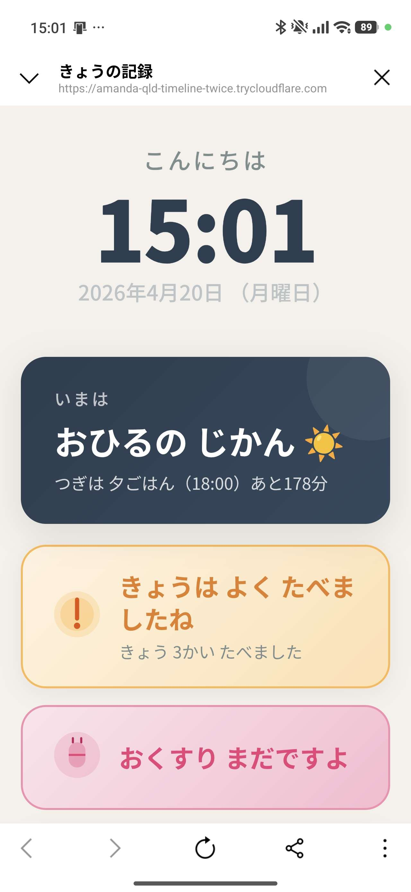
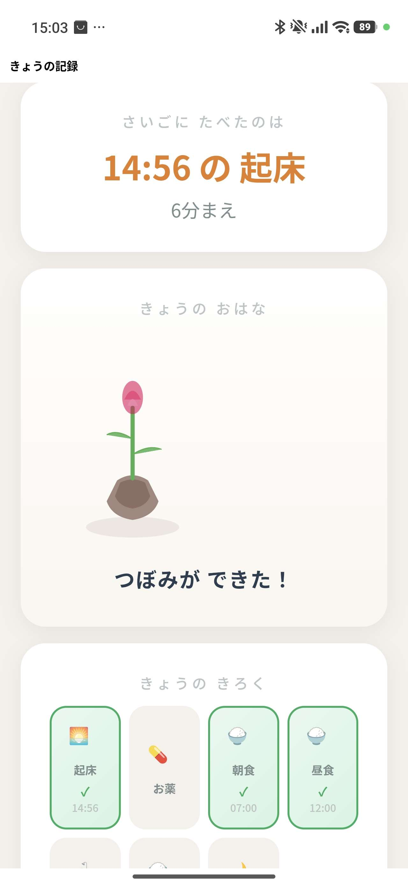
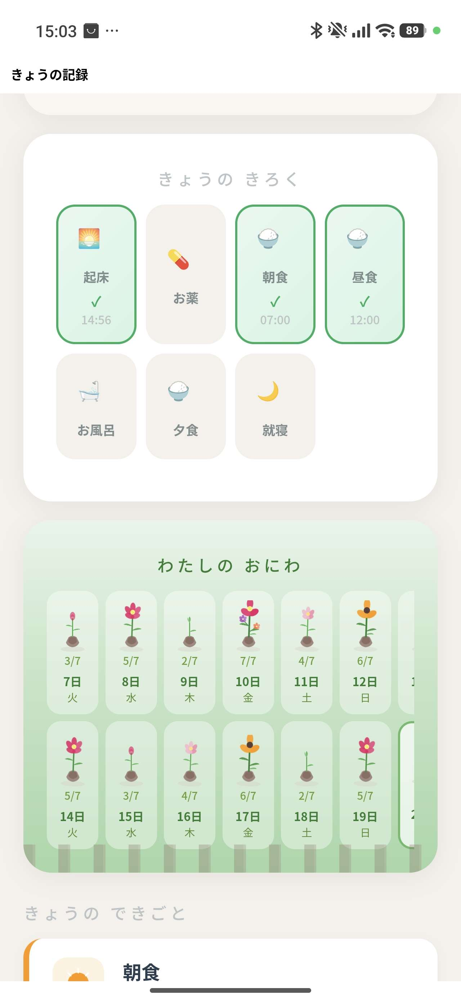
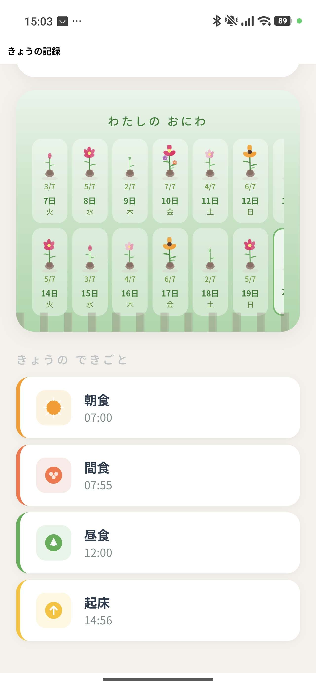
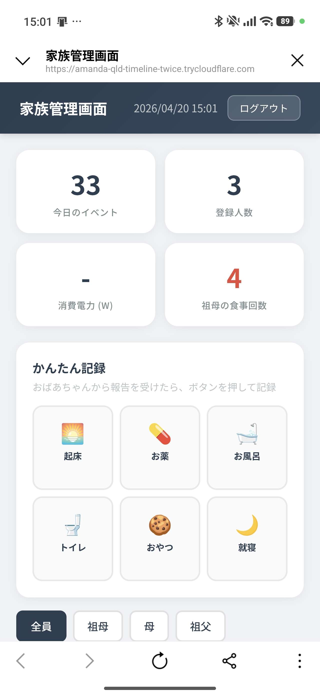
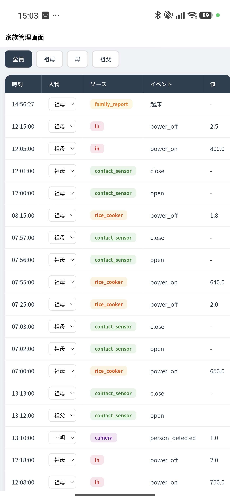
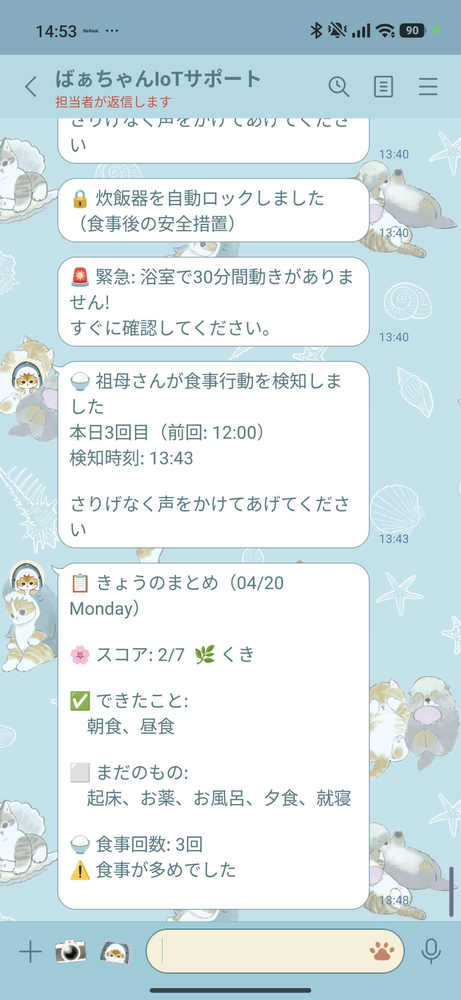

# IoT生活サポートシステム

認知症が進行した高齢者の日常生活をIoTセンサーでさりげなくサポートするシステム。
Raspberry Pi を中枢として、スマートプラグ・開閉センサー・モーションセンサー・カメラを統合し、生活リズムの記録・注意喚起・家族への通知を自動で行う。

## 設計思想

| 原則 | 説明 |
|------|------|
| **監視ではなく記録** | 本人には「自分の記録帳」として提示。監視されていると感じさせない |
| **指摘しない** | 「また食べたでしょ」ではなく「さっき たべましたよ」とやさしく表示 |
| **入力させない** | センサーで自動検知。本人のタブレット操作は不要 |
| **家族と連携** | 家族がスマホから状況確認・かんたん記録・ロック解除 |

## 主な機能

### 食事管理
- スマートプラグ（P110M, Matter対応）で炊飯器の電力を監視
- 開閉センサー（T110）で冷蔵庫のドア開閉を検知
- カメラ（C220）でキッチンの人物検知
- 複数センサーの組み合わせで「食事セッション」を自動判定
- 1日3回以上の食事検知 → 家族にLINE通知
- 短時間の再食事 → 炊飯器を自動ロック（電源OFF）

### お風呂安全監視
- 浴室ドアの開閉センサー（T110）+ 脱衣所のモーションセンサー（T100）
- 入浴開始/終了を自動記録
- 30分間動きがなければ家族にLINE緊急通知

### タブレットUI（本人向け）
- 大きな時計 + 時間帯ガイド（「いまは おひるごはんの じかん」）
- スタンプカード（起床・お薬・朝食・昼食・お風呂・夕食・就寝）
- SVGイラストによるお花の成長（達成数に応じて8段階で成長）
- 「わたしのおにわ」（過去14日分の花が庭に並ぶ成長記録）
- やさしい注意喚起（「さっき たべましたよ」「おくすり のみましたか？」）

### 家族管理画面
- パスワード認証
- 全イベント一覧（人物フィルタ・編集機能）
- 「かんたん記録」ボタン（家族が証人として1タップで記録）
- ロック状態表示 + 手動解除ボタン
- リアルタイム電力表示（WebSocket）

### LINE通知
- 食事回数超過アラート
- 炊飯器自動ロック通知
- お風呂緊急通知（長時間無動）
- 定期リマインド（お薬・お風呂・1日のまとめ）
- システムダウン/復旧通知

### 外部アクセス
- Cloudflare Tunnel で外出先からもアクセス可能
- トークン認証（外部アクセス時）
- URL更新時にLINEで自動通知

## アーキテクチャ

```
[P110M] ──Matter──┐
[T110]  ──H100────┼── monitor.py ── event_bus ── SQLite
[T100]  ──H100────┤       │
[C220]  ──RTSP────┘       ├── bath_monitor（入浴監視）
                          ├── lock_manager（自動ロック）
                          └── notifier（LINE通知）
                                  │
                          FastAPI (port 8000)
                          ├── /tablet  （本人用: 記録帳UI）
                          ├── /family  （家族用: 管理画面）
                          ├── /api/*   （REST API）
                          └── /ws/events (WebSocket)
                                  │
                          Cloudflare Tunnel
                          └── https://xxx.trycloudflare.com
```

## 技術スタック

| レイヤー | 技術 |
|---|---|
| スマートプラグ制御 | python-matter-server (Matter) / python-kasa (KLAP) |
| バックエンド | Python, FastAPI, SQLite |
| フロントエンド | HTML/CSS/JS, Jinja2, SVG |
| 顔認識 | face_recognition (dlib) |
| 通知 | LINE Messaging API |
| 外部公開 | Cloudflare Tunnel |
| 自動化 | systemd, cron |
| ハードウェア | Raspberry Pi 5 |

## セットアップ

```bash
# 1. リポジトリをクローン
git clone https://github.com/your-username/iot-life-support.git
cd iot-life-support

# 2. Python環境構築
python3 -m venv venv
source venv/bin/activate
pip install fastapi uvicorn python-kasa aiohttp requests jinja2 python-multipart face_recognition

# 3. 環境変数を設定
cp .env.example .env
# .env を編集してデバイスIP・パスワード・LINEトークンを記入

# 4. DB初期化
python -c "from src.db import init_db; init_db()"

# 5. Webサーバ起動
uvicorn src.web.app:app --host 0.0.0.0 --port 8000

# 6. センサー監視起動（別ターミナル）
python -m src.monitor

# 7. 外部公開（オプション）
bash scripts/start_tunnel.sh
```

## プロジェクト構成

```
├── src/
│   ├── db.py                ← DBスキーマ
│   ├── event_bus.py         ← イベント記録 + WebSocket配信
│   ├── sessions.py          ← 食事セッション集約
│   ├── monitor.py           ← 全センサー統合監視
│   ├── bath_monitor.py      ← お風呂安全監視
│   ├── garden.py            ← 庭（日次スコア・成長記録）
│   ├── face_id.py           ← 顔認識
│   ├── lock_manager.py      ← 機器ロック/アンロック
│   ├── notifier.py          ← LINE通知
│   ├── sensors/
│   │   ├── matter_plug.py   ← P110M電力監視 (Matter)
│   │   ├── contact_sensor.py ← T110開閉センサー
│   │   └── camera.py        ← C220カメラ (RTSP)
│   └── web/
│       ├── app.py           ← FastAPIサーバ
│       └── templates/
│           ├── tablet.html  ← 本人用UI
│           ├── family.html  ← 家族管理画面
│           └── login.html   ← ログイン画面
├── scripts/
│   ├── scheduled_notify.py  ← LINE定期通知
│   ├── start_tunnel.sh      ← Cloudflareトンネル起動
│   ├── health_check.sh      ← ヘルスチェック
│   ├── seed_mock_data.py    ← モックデータ投入
│   └── register_face.py     ← 顔登録CLI
├── systemd/                 ← systemdサービス定義
├── .env.example             ← 環境変数テンプレート
└── README.md
```

## スクリーンショット

### タブレット画面（本人向け）

大きな時計と時間帯ガイド、やさしい注意喚起メッセージを表示。



SVGイラストによるお花の成長と、スタンプカードで1日の達成状況を視覚化。



スタンプカード全体と「わたしのおにわ」（過去14日間の成長記録）。



「きょうのできごと」で1日の活動履歴を色分けアイコンで表示。



### 家族管理画面

ダッシュボード（イベント数・食事回数）と「かんたん記録」ボタン（証人として1タップ登録）。



イベント一覧。人物フィルタ・ソース別色分け・人物変更ドロップダウン。



### LINE通知

食事検知アラート、炊飯器自動ロック、浴室緊急通知、1日のまとめ。



## ライセンス

MIT License
